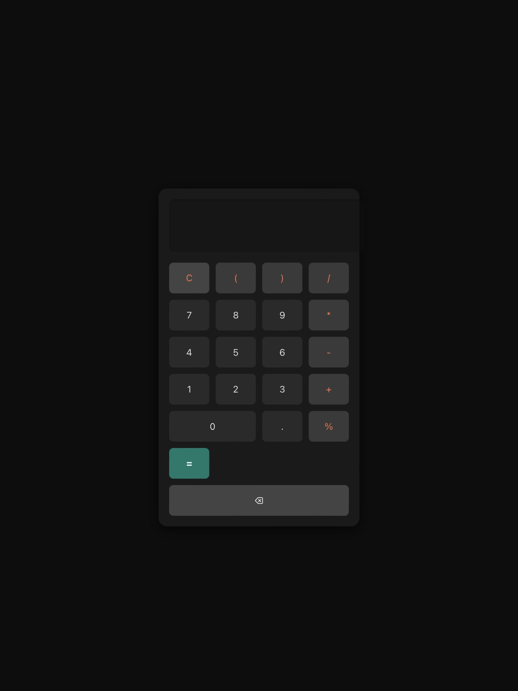

# better-dark-calculator



Idk it’s just better 
# 🖤 Dark Mode Calculator

A sleek **dark mode calculator** built with HTML, CSS, and JavaScript.  
Minimal, responsive, and stylish — with a glowing neon **equals** button for emphasis.

---

## ✨ Features
- Dark mode design for modern look
- Neon highlight for "=" button
- Supports basic arithmetic operations (+, −, ×, ÷)
- Clear button to reset calculations
- 100% frontend — no backend required
- Lightweight and fully customizable

---

## 🚀 How to Use
1. Clone or download this repository:
   ```bash
   git clone https://github.com/ne0c0der/dark-calculator.git
